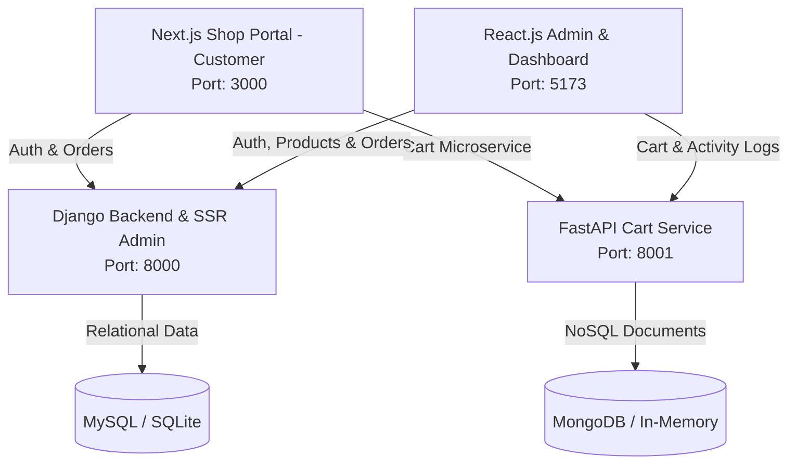

# ⚡ PCB E-commerce Platform

A production-ready full stack e-commerce platform for custom PCB fabrication & manufacturing. Built with modern microservices architecture, multi-role authentication interoperability, relational & NoSQL databases, and three distinct access interfaces.

---

## 📐 Architecture Overview



### Key Architectural Highlights:
- **Authentication Interoperability**: Shared HS256 JWT token secret signed by Django, validated across Next.js, React Admin, and FastAPI microservice middleware.
- **Relational Storage (MySQL / SQLite)**: Manages User profiles, Catalog Products, and Financial Orders with rigid ACID compliance.
- **NoSQL Document Storage (MongoDB)**: Stores transient cart items with complex custom PCB specification JSON models (layer count, thickness, copper weight, surface finish) and audit activity logs.

---

## 📁 Repository Structure

```text
pcb-ecommerce-platform/
├── backend/
│   ├── django/               # Django REST API, JWT Auth, Order Models & Server-Side Admin
│   │   ├── authentication/   # Custom User model (customer, admin, staff roles) & JWT views
│   │   ├── products/         # Product catalog endpoints & model specs
│   │   ├── orders/           # Order processing & approval pipeline (approve/reject)
│   │   ├── templates_admin/  # Classic SSR Django Template Admin UI (/admin/...)
│   │   ├── Dockerfile
│   │   └── seed.py           # Seeding script for initial users & products
│   └── fastapi-cart/         # FastAPI Cart & Activity Logs Microservice
│       ├── routers/          # Cart CRUD & Activity log endpoints
│       ├── auth.py           # JWT Bearer verification dependency
│       ├── database.py       # Async Motor MongoDB driver with resilient fallback
│       └── Dockerfile
├── frontend/
│   ├── nextjs-shop/          # Next.js Customer E-commerce Portal
│   │   ├── app/              # /products, /cart, /orders, /login, /register
│   │   └── Dockerfile
│   └── react-admin/          # React.js Role-based Admin & Customer Dashboard
│       ├── src/              # Role-based dashboard, order approvals & inventory control
│       └── Dockerfile
├── .github/workflows/ci.yml  # GitHub Actions CI pipeline
├── docker-compose.yml        # Multi-container orchestration
└── README.md
```

---

## 🔑 Demo Credentials & User Roles

| Role | Username | Password | Accessible Interfaces |
|---|---|---|---|
| **Admin** | `admin` | `adminpassword` | Django Templates (`/admin/login/`), React Admin (`/dashboard`), DRF APIs |
| **Customer** | `customer1` | `customerpassword` | Next.js Shop (`/login`), React Dashboard (`/dashboard`), DRF & FastAPI APIs |

---

## 🚀 Quick Start (Local Development)

### Option 1: Using Docker Compose (Recommended)

Run all 6 services (MySQL, MongoDB, Django, FastAPI, Next.js, React Admin) with a single command:

```bash
docker-compose up --build
```

Access services at:
- **Next.js Customer Shop**: [http://localhost:3000](http://localhost:3000)
- **React Admin Dashboard**: [http://localhost:5173](http://localhost:5173)
- **Django SSR Admin**: [http://localhost:8000/admin/login/](http://localhost:8000/admin/login/)
- **FastAPI OpenAPI Swagger Docs**: [http://localhost:8001/docs](http://localhost:8001/docs)
- **FastAPI ReDoc**: [http://localhost:8001/redoc](http://localhost:8001/redoc)

---

### Option 2: Standalone Execution

#### 1. Backend: Django API & Templates Admin
```bash
cd backend/django
python -m venv venv
# On Windows:
.\venv\Scripts\activate
# On Linux/macOS:
source venv/bin/activate

pip install -r requirements.txt
python manage.py migrate
python seed.py
python manage.py runserver 0.0.0.0:8000
```

#### 2. Backend: FastAPI Cart Microservice
```bash
cd backend/fastapi-cart
pip install -r requirements.txt
uvicorn main:app --host 0.0.0.0 --port 8001 --reload
```

#### 3. Frontend: Next.js Customer Shop
```bash
cd frontend/nextjs-shop
npm install
npm run dev
```

#### 4. Frontend: React.js Admin Dashboard
```bash
cd frontend/react-admin
npm install
npm run dev
```

---

## 📡 API Endpoints Summary

### Django REST Framework (`http://localhost:8000/api/`)
- `POST /auth/login/` - Issues JWT access and refresh tokens
- `POST /auth/register/` - Customer registration
- `GET /auth/me/` - Current authenticated user details
- `GET, POST /products/` - List products / Admin create product
- `GET, POST /orders/` - List user orders / Checkout new order
- `POST /orders/{id}/approve/` - Admin approve order
- `POST /orders/{id}/reject/` - Admin reject order

### Django Template SSR Admin (`http://localhost:8000/admin/`)
- `GET, POST /admin/login/` - Classic Admin login
- `GET /admin/dashboard/` - High-level metrics & order activity
- `GET, POST /admin/products/` - Add & list products
- `GET, POST /admin/orders/` - Approve & reject order actions

### FastAPI Cart Microservice (`http://localhost:8001/`)
- `GET /cart/` - Fetch user's cart from MongoDB
- `POST /cart/items` - Add item to cart with custom PCB specs
- `PUT /cart/items/{item_id}` - Update quantity or specs
- `DELETE /cart/items/{item_id}` - Remove item from cart
- `DELETE /cart/` - Clear cart upon checkout
- `GET /activity-logs/` - Admin audit logging
- `GET /docs` - Interactive Swagger OpenAPI UI

---

## 🌐 Production Deployment Guide

### Deploying Frontends on Vercel
1. Push repository to GitHub.
2. Link `frontend/nextjs-shop` directory to Vercel project.
3. Configure Environment Variables:
   - `NEXT_PUBLIC_DJANGO_API_URL`: `https://your-django-backend.up.railway.app/api`
   - `NEXT_PUBLIC_FASTAPI_CART_URL`: `https://your-fastapi-cart.up.railway.app`

### Deploying Backends on Railway or Render
1. **Django Backend**:
   - Use Dockerfile in `backend/django/Dockerfile`.
   - Provision a MySQL database plugin on Railway/Render.
   - Set environment variables: `MYSQL_HOST`, `MYSQL_DATABASE`, `MYSQL_USER`, `MYSQL_PASSWORD`, `JWT_SECRET_KEY`.
2. **FastAPI Cart Microservice**:
   - Use Dockerfile in `backend/fastapi-cart/Dockerfile`.
   - Provision a MongoDB database instance (MongoDB Atlas or Railway Mongo plugin).
   - Set environment variables: `MONGO_URI`, `JWT_SECRET_KEY`.

---

## 🧪 CI/CD Pipeline

Included in `.github/workflows/ci.yml`:
- Automated test runners for Django (`python manage.py test`).
- Verification of FastAPI microservice initialization.
- Node.js build validation for Next.js (`npm run build`) and React (`npm run build`).
